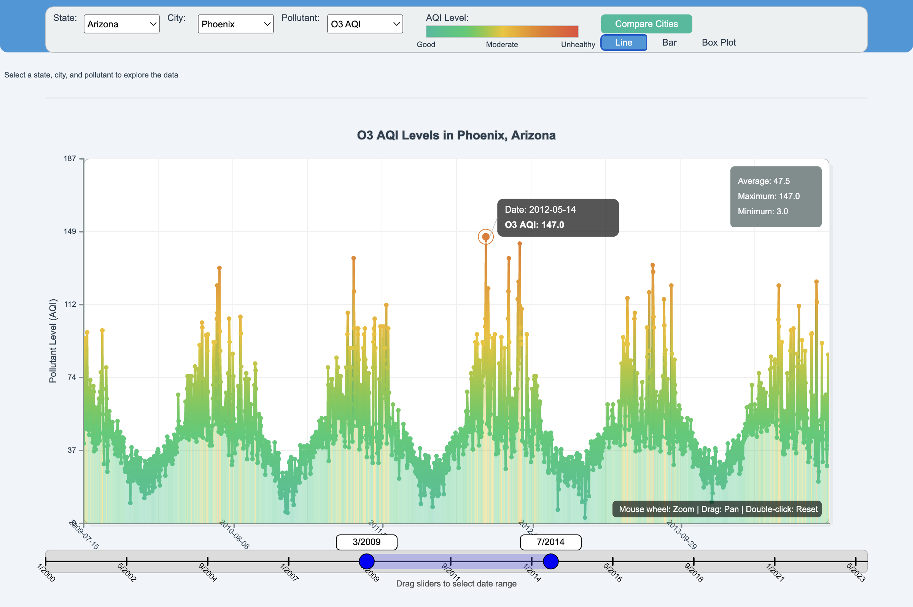
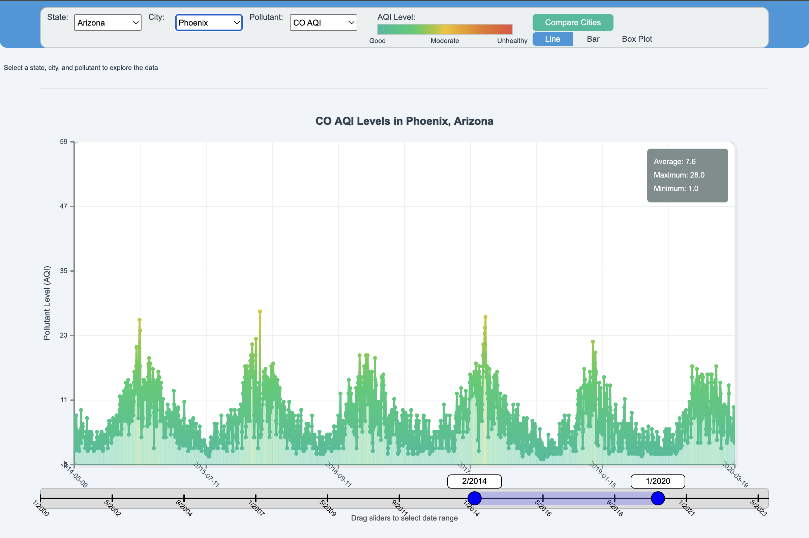
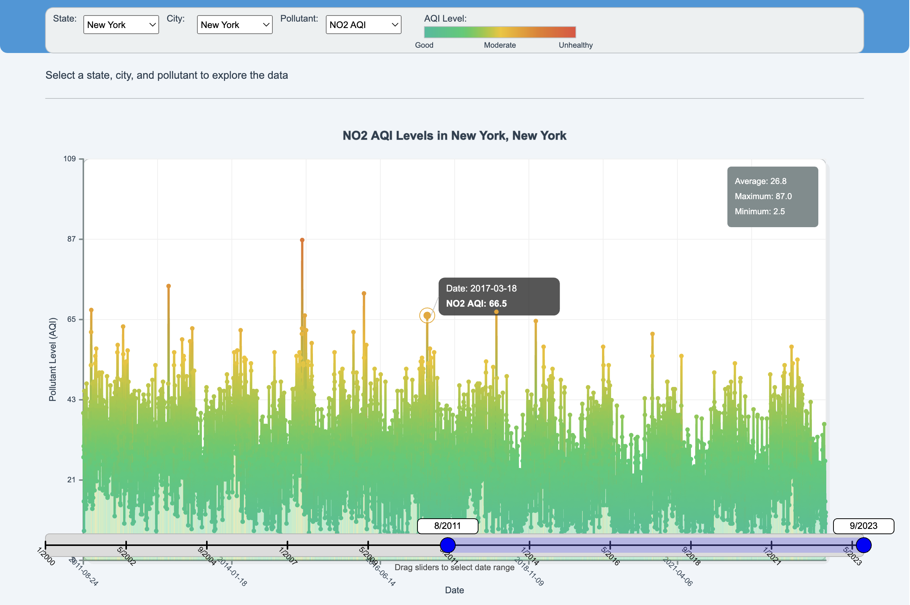
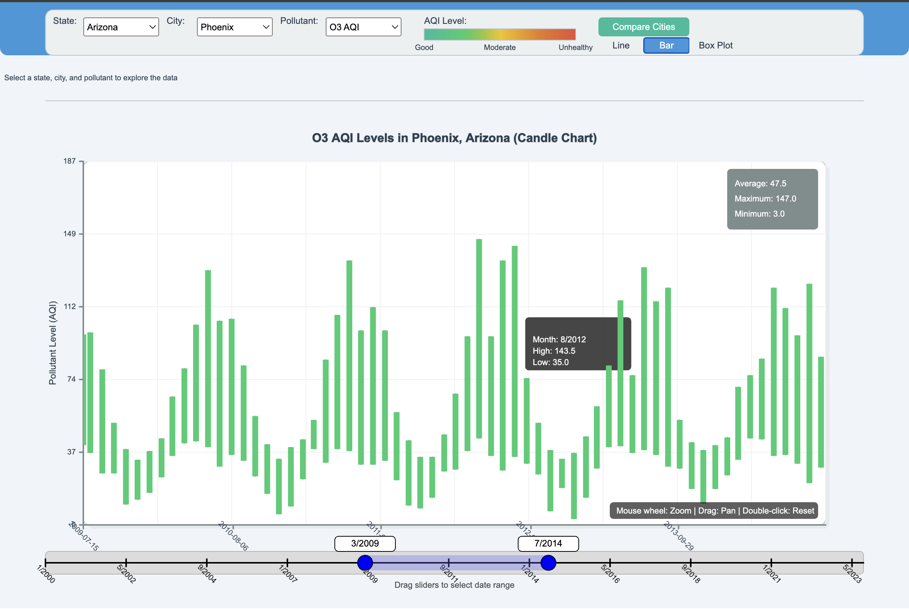
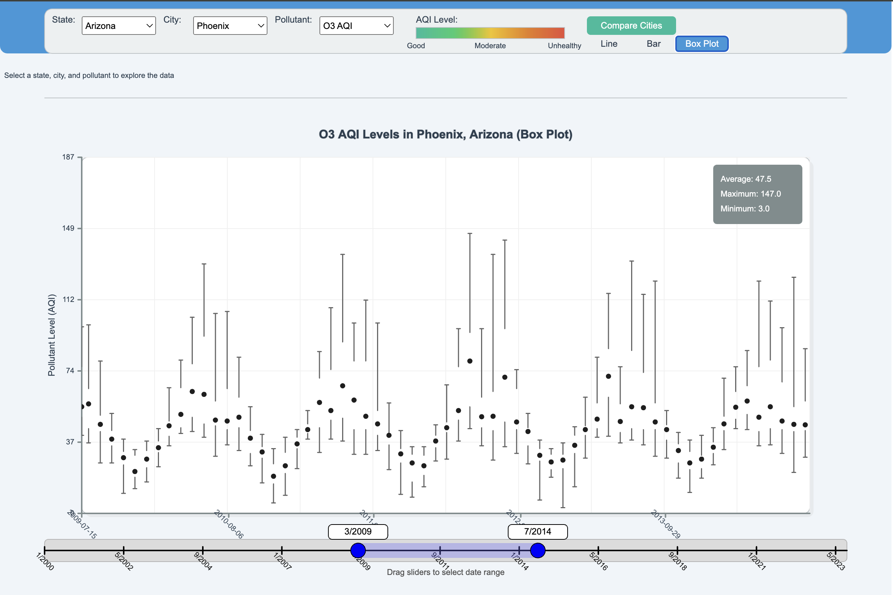
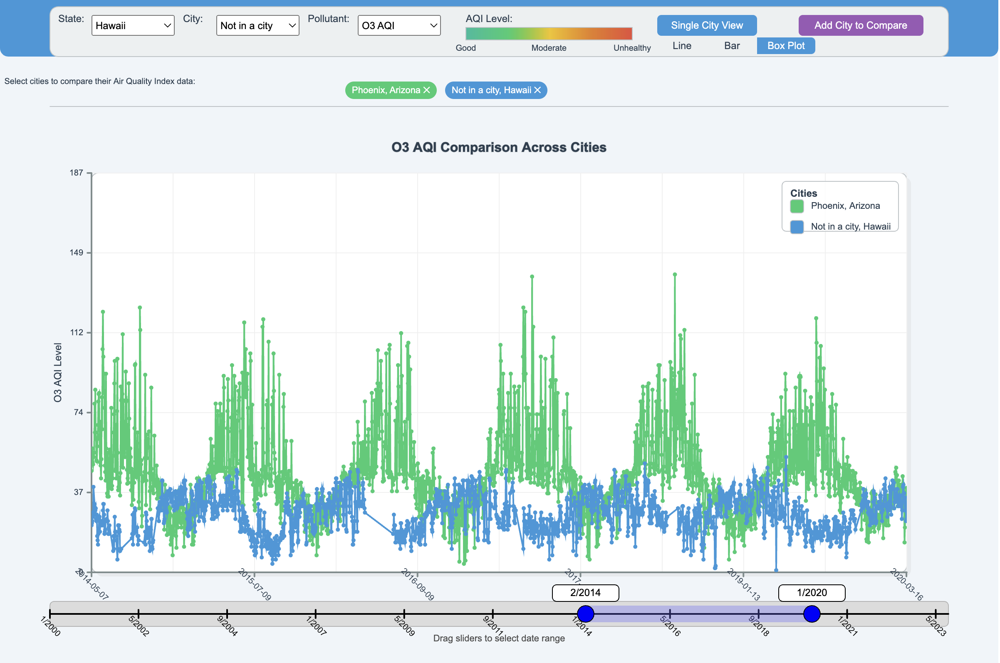

# Air Quality Data Visualization

## Project Overview
This interactive visualization tool allows users to explore air quality data across different cities and states in the United States from 2000 to 2023. The application provides an intuitive interface to analyze pollution trends over time, compare different pollutants, and understand air quality patterns.

## Features
- **Location Selection**: Filter data by state and city
- **Pollutant Selection**: Choose from different pollutants (O3, CO, SO2, NO2)
- **Time Range Control**: Interactive slider to select specific date ranges
- **Dynamic Visualization**: Color-coded line graphs showing pollution trends
- **Statistical Insights**: View averages, maximums, and minimums for selected data
- **Interactive Elements**: Hover over data points to see detailed information
- **Responsive Design**: Beautiful UI with intuitive controls

## Data Description
The project uses the `pollution_2000_2023.csv` dataset which contains air quality measurements from various locations. The dataset includes the following key columns:

- **Date**: Time of measurement
- **State**, **County**, **City**: Location information
- **O3 AQI**, **CO AQI**, **SO2 AQI**, **NO2 AQI**: Air Quality Index values for different pollutants

This dataset provides comprehensive air quality measurements that enable exploration of questions such as:
- How does air quality vary across different cities or states?
- Are there seasonal patterns in air quality measurements?
- How do pollution levels change over time?

## Technologies Used
- **p5.js**: Core visualization library
- **HTML/CSS**: Basic structure and styling
- **JavaScript**: Interactive functionality and data processing
- **Local HTTP Server**: For loading CSV data

## Installation and Usage

### Prerequisites
- Web browser (Chrome, Firefox, Safari recommended)
- Local HTTP server (Python's http.server, Node's http-server, etc.)

### Setup Instructions
1. Clone this repository:
   ```
   git clone https://github.com/yourusername/air-quality-visualization.git
   cd air-quality-visualization
   ```

2. Start a local HTTP server:
   ```
   # Using Python 3:
   python -m http.server 8000
   
   # OR using Node.js:
   npx http-server
   ```

3. Open your browser and navigate to:
   ```
   http://localhost:8000
   ```

### How to Use
1. Select a state from the dropdown menu
2. Choose a city within that state
3. Select a pollutant to visualize (O3, CO, SO2, or NO2)
4. Use the time slider at the bottom to adjust the date range
5. Hover over data points to see detailed information
6. Analyze trends in the graph and review the statistics

## Future Enhancements
- Implement map-based visualization
- Include weather data correlation
- Add more advanced statistical analysis
- Export functionality for reports

## Screenshots
### AQI for O3 in Arizona


### AQI for CO in Arizona


### AQI for NO2 in New York


### AQI for O3 in Arizona with bar graph


### AQI for O3 in Arizona with box plot


### AQI comparison for O3 in Arizona and Hawaii



## Acknowledgments
- [Kaggle source](https://www.kaggle.com/datasets/guslovesmath/us-pollution-data-200-to-2022?select=pollution_2000_2023.csv) for air quality data
- p5.js community for visualization tools
